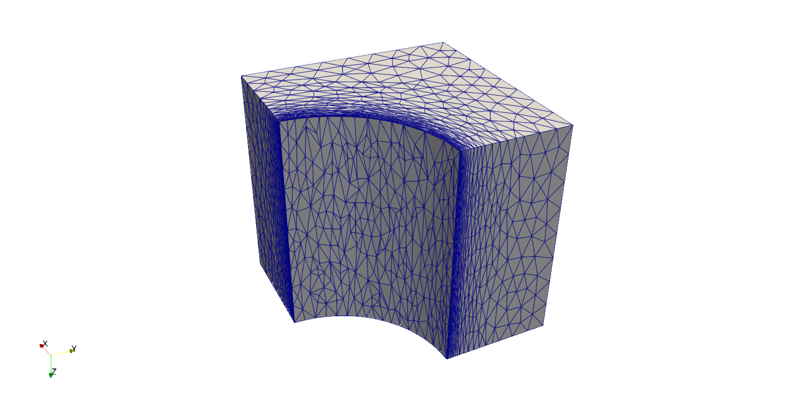
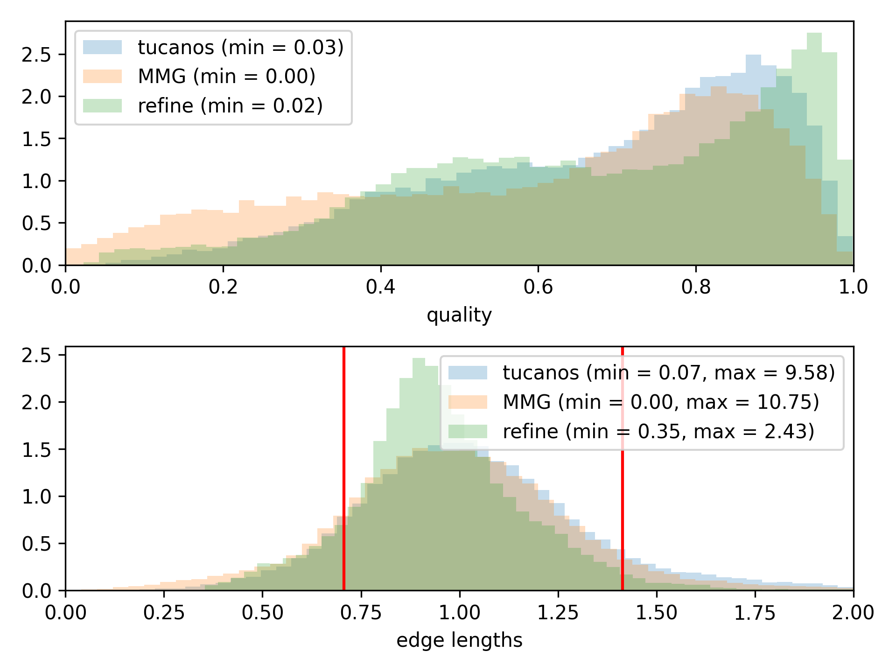
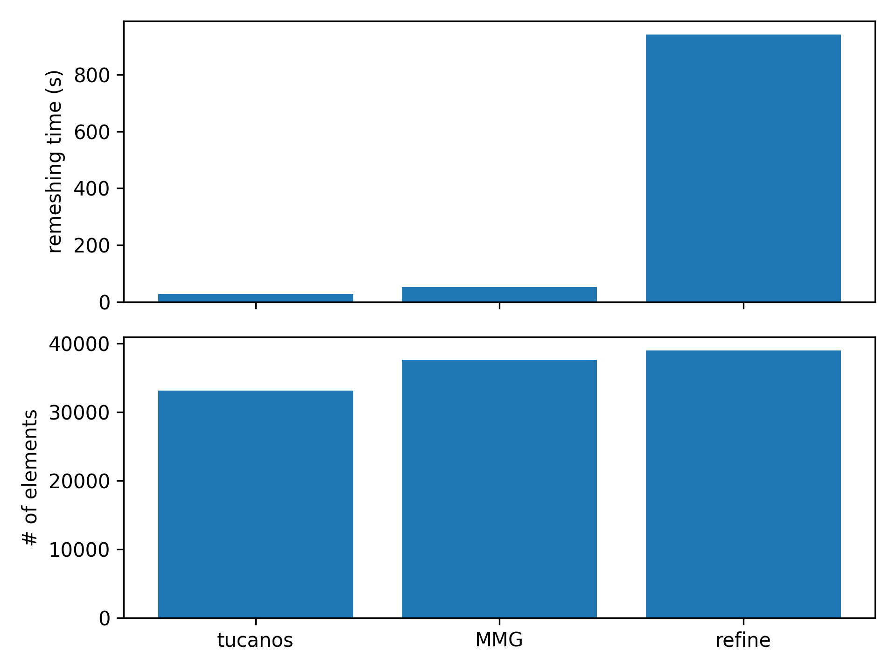

# Anisotropic remeshing in a cube

## Configuration

This is the [polar-1](https://github.com/UGAWG/adapt-benchmarks/tree/master/cube-cylinder) benchmark from the Unstructured Grid Adaptation Working Group.

NB: the metric is not limited at each remeshing step



## Initial mesh

Gmsh `.geo` files are provided to generate the initial mesh (identical to the UGAWG benchmark) and a stl-like geometry. The input mesh can be generated as
```
wget https://raw.githubusercontent.com/UGAWG/adapt-benchmarks/master/cube-cylinder/cube-cylinder.step
wget https://raw.githubusercontent.com/UGAWG/adapt-benchmarks/master/cube-cylinder/cube-cylinder.egads
wget https://raw.githubusercontent.com/UGAWG/adapt-benchmarks/master/cube-cylinder/cube-cylinder.meshb
gmsh cube-cylinder.geo -3 -o cube-cylinder.mesh
gmsh cube-cylinder-boundary.geo -2 -o cube-cylinder-boundary.mesh
```

## Results after 5 iterations

<!-- (NB: metric limiting applied to avro) -->




