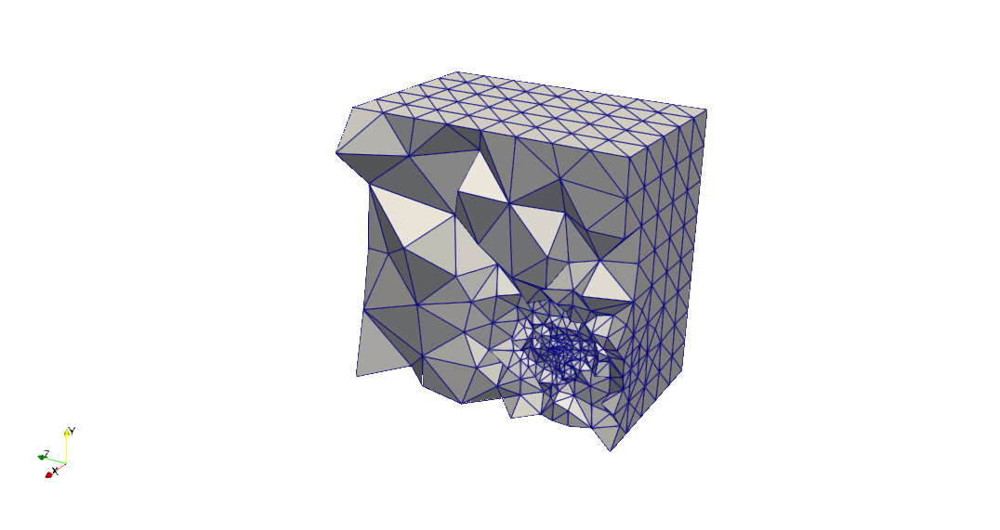
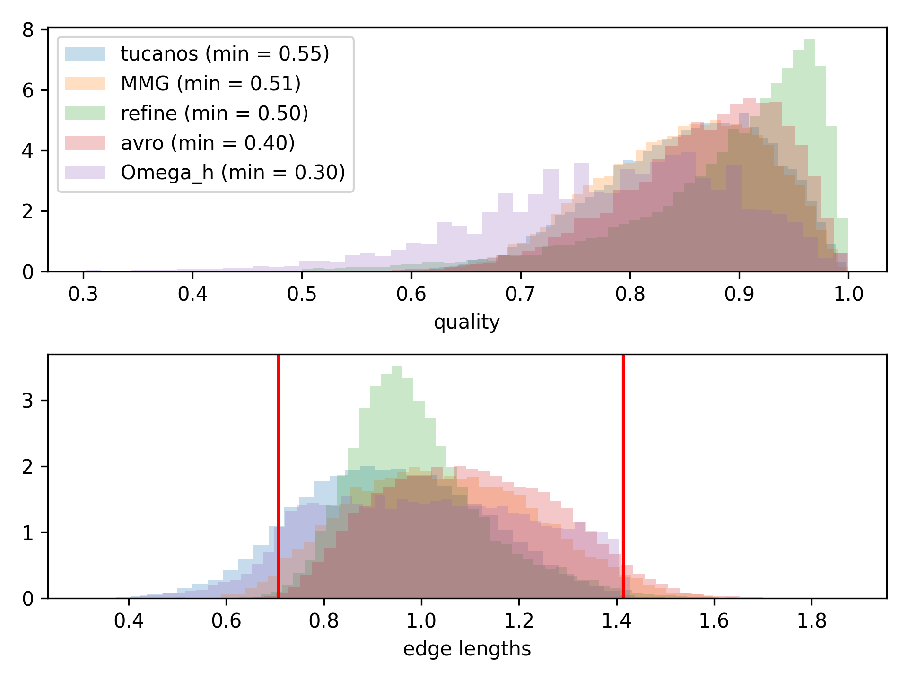
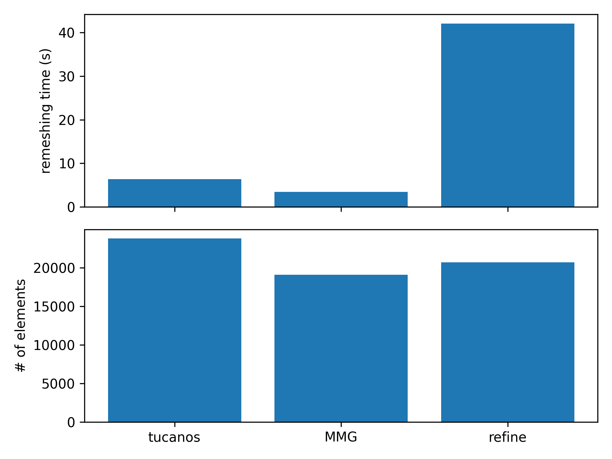

# Isotropic remeshing in a cube

## Configuration

The geometry is an unit cube.

The target isotropic cell size is 
$$h = h_{min} + (h_{max} - h_{min})  (
            1 - exp(-((x - 0.5)^2 + (y - 0.25)^2+ (z - 0.25)^2) / 0.25^2)
        )$$
with $h_{min} = 0.01$ and $h_{max} = 0.3$

## Start mesh

An initial mesh only containing 5 tetrahedra is uniformly refined 3 times.

## Results

