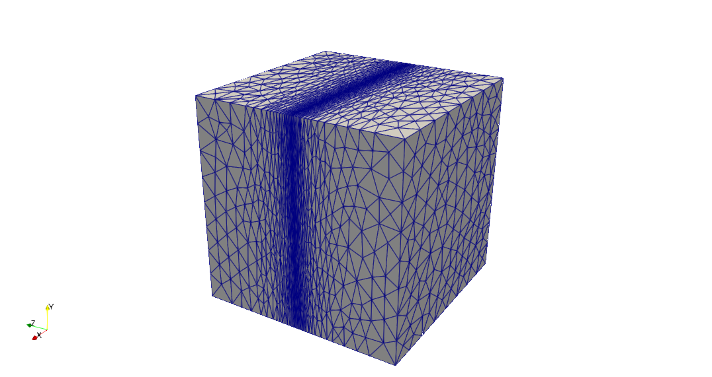
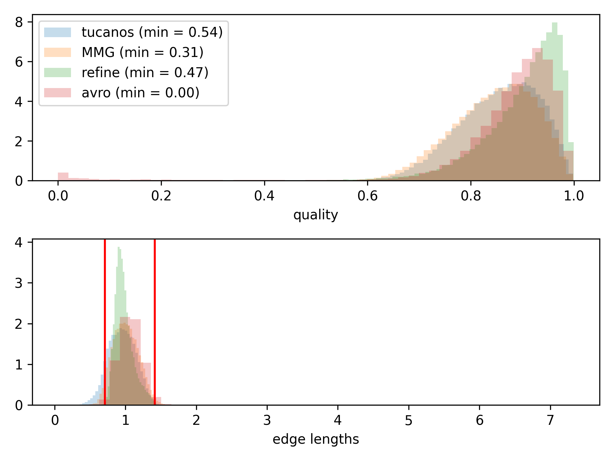
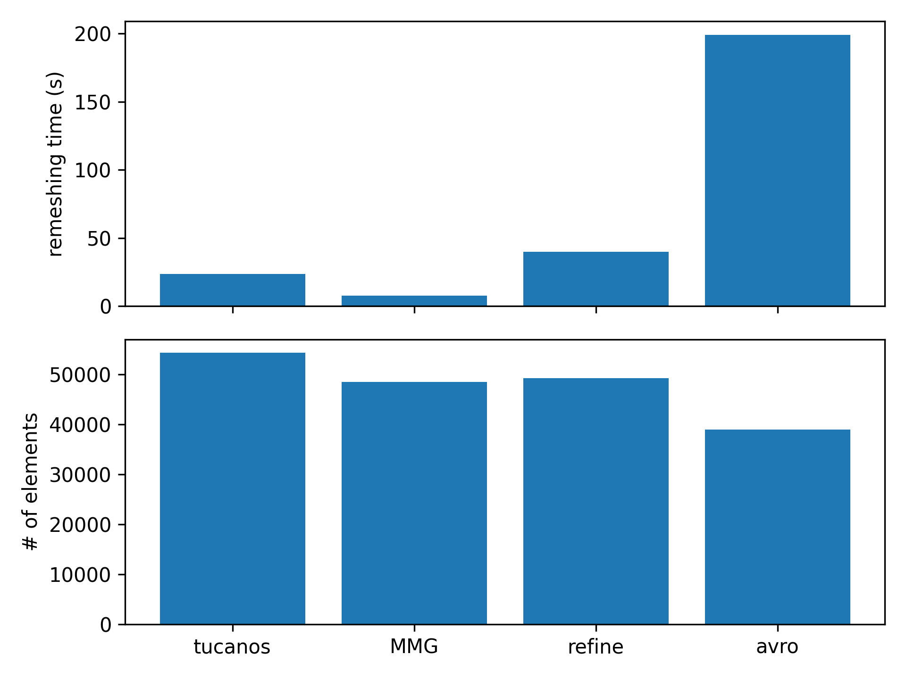

# Anisotropic remeshing in a cube

## Configuration

This is the [linear](https://github.com/UGAWG/adapt-benchmarks/tree/master/cube) benchmark from the Unstructured Grid Adaptation Working Group.



## Start mesh

The initial mesh only contains 5 tetrahedra. 5 iterations are performed to reach the target metric.

As the quality of the initial mesh is quite high, one should allow a decrease of the mesh quality during split and collapse loops, e.g. by setting
```python
remesher.remesh(
    split_min_q_rel=0.5,
    collapse_min_q_rel=0.5,
)
```

## Results after 5 iterations




