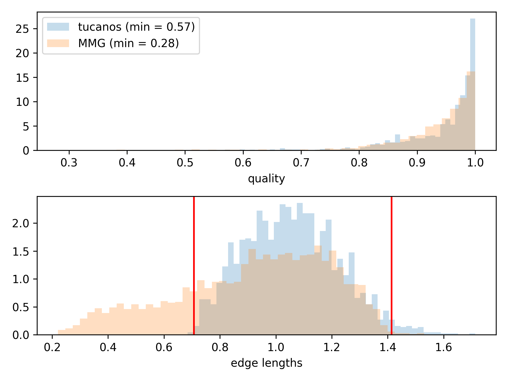
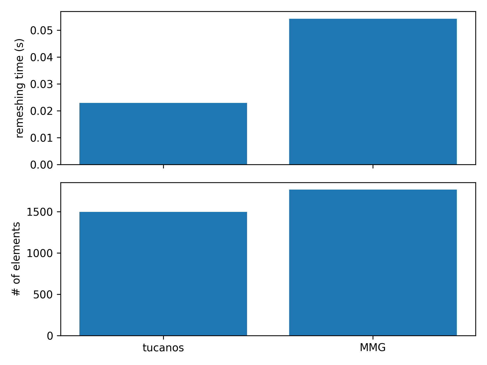

# Isotropic remeshing in a square

## Configuration

The geometry is an unit square with two different tags above and below the diagonal, so there is an internal surface.

The target isotropic cell size is 
$$h = h_{min} + (h_{max} - h_{min})  (
            1 - exp(-((x - 0.5)^2 + (y - 0.25)^2) / 0.25^2)
        )$$
with $h_{min} = 0.01$ and $h_{max} = 0.3$


## Start mesh

The initial mesh only contains two triangles, so 5 iterations are required to reach the target cell sizes.

As the quality of the initial mesh is quite high, one should allow a decrease of the mesh quality during split and collapse loops, e.g. by setting
```python
remesher.remesh(
    split_min_q_rel=0.5,
    collapse_min_q_rel=0.5,
)
```

## Results after 5 iterations





