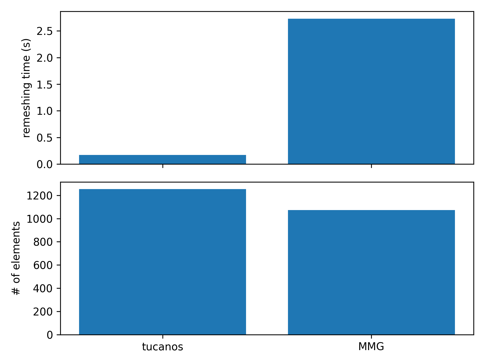

# Anisotropic remeshing in a square

## Configuration

The geometry is an unit square with two different tags above and below the diagonal, so there is an internal surface.

The target anisotropic cell size are 
- $h_x = 0.5$
- $h_y =  h_0 + 2 (0.1 - h_0)|y - 0.5|$ with $h_0 = 0.001$

## Start mesh

The initial mesh only contains two triangles. 4 iterations are performed to avoid differences with the metric interpolation.

## Results after 5 iterations

